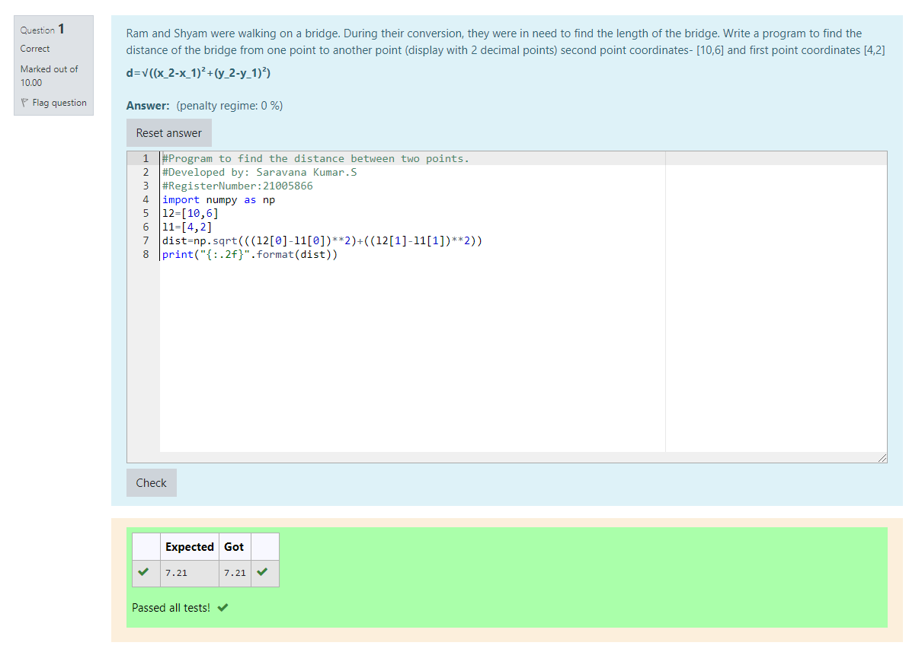

# DISTANCE-BETWEEN-TWO-POINTS

## AIM:
To write a python program to find the distance two 2 points
## ALGORITHM:
### Step 1: 
First import numpy.
### Step 2: 
Then assign the given data as l1 and l2.
### Step 3: 
Substitute the values in the distance formula.

### Step 4: 
Now print the value with two decimal points.
### Step 5:
Hence we got the desired  output.
### PROGRAM:
```
import numpy as np
l2=[10,6]
l1=[4,2]
dist=np.sqrt(((l2[0]-l1[0])**2)+((l2[1]-l1[1])**2))
print("{:.2f}".format(dist))
```


### OUTPUT:


### RESULT:
Thus we got the distance between two points.